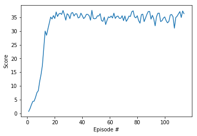

```python
#udacity 
!pip -q install ./python
```

    tensorflow 1.7.1 has requirement numpy>=1.13.3, but you'll have numpy 1.12.1 which is incompatible.
    ipython 6.5.0 has requirement prompt-toolkit<2.0.0,>=1.0.15, but you'll have prompt-toolkit 3.0.18 which is incompatible.


```python
import sys, os
sys.path.append(os.getcwd())
print(sys.path)
```

    ['', '/opt/spark-2.4.3-bin-hadoop2.7/python', '/opt/spark-2.4.3-bin-hadoop2.7/python/lib/py4j-0.10.7-src.zip', '/home/workspace', '/opt/conda/lib/python36.zip', '/opt/conda/lib/python3.6', '/opt/conda/lib/python3.6/lib-dynload', '/opt/conda/lib/python3.6/site-packages', '/opt/conda/lib/python3.6/site-packages/Mako-1.0.7-py3.6.egg', '/opt/conda/lib/python3.6/site-packages/cycler-0.10.0-py3.6.egg', '/opt/conda/lib/python3.6/site-packages/torchvision-0.2.1-py3.6.egg', '/opt/conda/lib/python3.6/site-packages/IPython/extensions', '/root/.ipython', '/home/workspace']


```python
from unityagents import UnityEnvironment
import numpy as np
```


```python
#env = UnityEnvironment(file_name='Reacher20.app', no_graphics=True)

#udacity 
env = UnityEnvironment(file_name='/data/Reacher_Linux_NoVis/Reacher.x86_64')
```

    INFO:unityagents:
    'Academy' started successfully!
    Unity Academy name: Academy
            Number of Brains: 1
            Number of External Brains : 1
            Lesson number : 0
            Reset Parameters :
    		goal_size -> 5.0
    		goal_speed -> 1.0
    Unity brain name: ReacherBrain
            Number of Visual Observations (per agent): 0
            Vector Observation space type: continuous
            Vector Observation space size (per agent): 33
            Number of stacked Vector Observation: 1
            Vector Action space type: continuous
            Vector Action space size (per agent): 4
            Vector Action descriptions: , , , 


```python
# get the default brain
brain_name = env.brain_names[0]
brain = env.brains[brain_name]
brain_name
```


    'ReacherBrain'


```python
# reset the environment
env_info = env.reset(train_mode=True)[brain_name]

# number of agents
num_agents = len(env_info.agents)
print('Number of agents:', num_agents)

# size of each action
action_size = brain.vector_action_space_size
print('Size of each action:', action_size)

# examine the state space 
states = env_info.vector_observations
state_size = states.shape[1]
print('There are {} agents. Each observes a state with length: {}'.format(states.shape[0], state_size))
print('The state for the first agent looks like:', states[0])
```

    Number of agents: 20
    Size of each action: 4
    There are 20 agents. Each observes a state with length: 33
    The state for the first agent looks like: [  0.00000000e+00  -4.00000000e+00   0.00000000e+00   1.00000000e+00
      -0.00000000e+00  -0.00000000e+00  -4.37113883e-08   0.00000000e+00
       0.00000000e+00   0.00000000e+00   0.00000000e+00   0.00000000e+00
       0.00000000e+00   0.00000000e+00  -1.00000000e+01   0.00000000e+00
       1.00000000e+00  -0.00000000e+00  -0.00000000e+00  -4.37113883e-08
       0.00000000e+00   0.00000000e+00   0.00000000e+00   0.00000000e+00
       0.00000000e+00   0.00000000e+00   5.75471878e+00  -1.00000000e+00
       5.55726624e+00   0.00000000e+00   1.00000000e+00   0.00000000e+00
      -1.68164849e-01]


```python
from ddpg_agent import Agent

agent = Agent(state_size, action_size, random_seed=2)
```


```python
from collections import deque
import matplotlib.pyplot as plt
import torch
from timeit import default_timer as timer

# Udacity GPU use max_t=1000
# target_window, keep at 100 to solve environment
# target_score for SMA, keep at 30 to solve environment
def ddpg(n_episodes=500, max_t=1000, print_every=10, target_window=100, target_score=30):
    scores_deque = deque(maxlen=target_window)
    scores_total = []
    train_every = 20
    train_iterations = 10
    
    for i_episode in range(1, n_episodes+1):
        
        env_info = env.reset(train_mode=True)[brain_name]
        states = env_info.vector_observations
        scores = np.zeros(num_agents)
        agent.reset()
         
        start = timer()
        for t in range(max_t):
            
            actions = agent.act(states)
            #print(actions)
            env_info = env.step(actions)[brain_name]
            next_states = env_info.vector_observations #[0]
            rewards = env_info.rewards #[0]
            dones = env_info.local_done #[0]
            
            train = not bool(t % train_every)
            
            for state, action, reward, next_state, done in zip(states, actions, rewards, next_states, dones):         
                agent.step(state, action, reward, next_state, done, train, train_iterations)
            states = next_states
            scores += rewards
            #print(scores)
            if np.any(dones):
                break 
        end = timer()
        delta = end - start
        scores_mean = np.mean(scores)
        scores_deque.append(scores_mean)
        scores_total.append(scores_mean)
        sma = np.mean(scores_deque)
        print('\rEpisode {}\tAverage Score: {:.2f}\tLast Mean: {:.2f}'.format(i_episode, sma, scores_mean), end="")
        torch.save(agent.actor_local.state_dict(), 'checkpoint_actor.pth')
        torch.save(agent.critic_local.state_dict(), 'checkpoint_critic.pth')
        if i_episode % print_every == 0:
            sma_slice = [ int(s*100)/100.0 for s in scores_deque][-5:]
            print('\rEpisode {}\tAverage Score: {:.2f}\t({:.0f} sec)\t{}'.format(i_episode, sma, delta, sma_slice))
              
        sma_bool = [s >= target_score for s in scores_deque]
        #print(scores_deque)
        if np.all(sma_bool) and len(sma_bool) >= target_window: 
            print("\n*** Environment Solved ***")
            break
                
            
    return scores_total, scores_deque

scores, sma = ddpg()
print([ int(s*100)/100.0 for s in sma])
#print(scores)
fig = plt.figure()
ax = fig.add_subplot(111)
plt.plot(np.arange(1, len(scores)+1), scores)
plt.ylabel('Score')
plt.xlabel('Episode #')
plt.show()
```

    Episode 10	Average Score: 6.16	(111 sec)	[5.82, 7.52, 8.24, 11.55, 14.12]
    Episode 20	Average Score: 18.24	(111 sec)	[32.88, 35.09, 34.38, 35.64, 34.57]
    Episode 30	Average Score: 24.18	(111 sec)	[37.48, 35.95, 33.98, 36.3, 35.85]
    Episode 40	Average Score: 27.08	(111 sec)	[36.26, 34.77, 34.99, 36.51, 35.6]
    Episode 50	Average Score: 28.71	(111 sec)	[33.96, 37.54, 34.61, 34.47, 34.62]
    Episode 60	Average Score: 29.70	(111 sec)	[35.08, 32.37, 33.91, 35.16, 34.91]
    Episode 70	Average Score: 30.47	(111 sec)	[35.45, 34.62, 34.66, 35.58, 33.79]
    Episode 80	Average Score: 31.08	(111 sec)	[37.02, 37.37, 35.17, 34.81, 35.55]
    Episode 90	Average Score: 31.54	(112 sec)	[34.73, 36.08, 37.11, 37.14, 34.35]
    Episode 100	Average Score: 31.86	(111 sec)	[36.52, 33.45, 33.77, 34.7, 35.15]
    Episode 110	Average Score: 34.69	(112 sec)	[35.18, 31.05, 34.89, 35.42, 36.28]
    Episode 114	Average Score: 35.15	Last Mean: 36.34
    *** Environment Solved ***
    [30.72, 32.88, 35.09, 34.38, 35.64, 34.57, 36.94, 35.31, 36.26, 36.47, 36.06, 37.48, 35.95, 33.98, 36.3, 35.85, 34.52, 36.53, 36.74, 35.47, 36.27, 36.26, 34.77, 34.99, 36.51, 35.6, 34.54, 35.06, 36.08, 36.07, 35.58, 33.96, 37.54, 34.61, 34.47, 34.62, 35.54, 35.48, 36.31, 33.81, 33.54, 35.08, 32.37, 33.91, 35.16, 34.91, 35.47, 34.76, 36.52, 34.6, 35.31, 35.45, 34.62, 34.66, 35.58, 33.79, 35.49, 33.52, 34.3, 35.47, 35.32, 37.02, 37.37, 35.17, 34.81, 35.55, 33.77, 32.88, 35.96, 36.16, 33.44, 34.73, 36.08, 37.11, 37.14, 34.35, 35.73, 34.44, 31.91, 35.24, 36.48, 36.52, 33.45, 33.77, 34.7, 35.15, 33.82, 32.98, 33.51, 35.86, 36.03, 35.18, 31.05, 34.89, 35.42, 36.28, 37.08, 34.95, 37.3, 36.33]


    <matplotlib.figure.Figure at 0x7f3da57bdbe0>


When finished, you can close the environment.


```python
fig = plt.figure()
ax = fig.add_subplot(111)
plt.plot(np.arange(1, len(scores)+1), scores)
plt.ylabel('Score')
plt.xlabel('Episode #')
plt.savefig("scores.png")
```





```python
env.close()
```


```python

```
