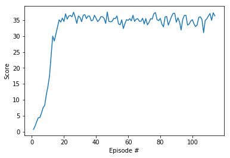

# REPORT

This report illustrates the approach taken to solve the environment. Artficats of the solution can been seen in Continous_Control.md or Continuous_Control.html.


## 1st Attempt

In a first the attempt the Reacher environment with single agent was tried. The algorithm chosen was DDPG as used in the Udacity project ddpg-pendulum. 

This attempt was not successful. The agent learned very slowly and learning stagnated after a few episodes. In an attempt to improve learning the following hyper-parameters were changed:

```python
LR_ACTOR = 1e-3  # from 1e-4
max_t=1000       # from max_t=300
```

That means the learning rate was increased for the actor to speed up learning. And the timesteps for each episode was increase significanlty. The latter increased the runtime noticeably. 

Futhermore batch normalization was added to the critic network.

The result was positive. Learning increased, but tapered out at single digits.


## 2nd Attempt

To increase the number of samples recorded for training the multi-agent Reacher environment was chosen. This environment has 20 agents running in parallel. The agent code needed updates to accomodate this environment. 

The result was markedly improved learning, reaching a reward of about 10 after 40 episodes. From then learning kind of stagnated. 


## 3rd Attempt

Udacity instructions included hints at how to solve this environment. Specifically the two hints below were implemented:

```python
torch.nn.utils.clip_grad_norm(self.critic_local.parameters(), 1)

train_every = 20
train_iterations = 10

```

The 1st tweak introduces gradient clipping when training the critic. The 2nd tweak trains the networks less frequently. Specifically only train every 20 timesteps for 10 iterations.

This improved the training yet again. However, the averge score would not exceed about 15.

## 4th Attempt and Solution

The exploration of DDPG is aided with random noise. This noise is generated by the Ornstein-Uhlenbeck process in the learn method of the agent. Noise was added with a uniform distribution [0,1]. This suggest a bias towards positive noise. Instead standard random noise was used, with `mean=0 std=1`.

This led to the final breakthrough. The agent trained signifcantly faster and solved the environment in 114 episodes.




Runtime log:

```

    Episode 10	Average Score: 6.16	(111 sec)	[5.82, 7.52, 8.24, 11.55, 14.12]
    Episode 20	Average Score: 18.24	(111 sec)	[32.88, 35.09, 34.38, 35.64, 34.57]
    Episode 30	Average Score: 24.18	(111 sec)	[37.48, 35.95, 33.98, 36.3, 35.85]
    Episode 40	Average Score: 27.08	(111 sec)	[36.26, 34.77, 34.99, 36.51, 35.6]
    Episode 50	Average Score: 28.71	(111 sec)	[33.96, 37.54, 34.61, 34.47, 34.62]
    Episode 60	Average Score: 29.70	(111 sec)	[35.08, 32.37, 33.91, 35.16, 34.91]
    Episode 70	Average Score: 30.47	(111 sec)	[35.45, 34.62, 34.66, 35.58, 33.79]
    Episode 80	Average Score: 31.08	(111 sec)	[37.02, 37.37, 35.17, 34.81, 35.55]
    Episode 90	Average Score: 31.54	(112 sec)	[34.73, 36.08, 37.11, 37.14, 34.35]
    Episode 100	Average Score: 31.86	(111 sec)	[36.52, 33.45, 33.77, 34.7, 35.15]
    Episode 110	Average Score: 34.69	(112 sec)	[35.18, 31.05, 34.89, 35.42, 36.28]
    Episode 114	Average Score: 35.15	Last Mean: 36.34
    *** Environment Solved ***
    [30.72, 32.88, 35.09, 34.38, 35.64, 34.57, 36.94, 35.31, 36.26, 36.47, 36.06, 37.48, 35.95, 33.98, 36.3, 35.85, 34.52, 36.53, 36.74, 35.47, 36.27, 36.26, 34.77, 34.99, 36.51, 35.6, 34.54, 35.06, 36.08, 36.07, 35.58, 33.96, 37.54, 34.61, 34.47, 34.62, 35.54, 35.48, 36.31, 33.81, 33.54, 35.08, 32.37, 33.91, 35.16, 34.91, 35.47, 34.76, 36.52, 34.6, 35.31, 35.45, 34.62, 34.66, 35.58, 33.79, 35.49, 33.52, 34.3, 35.47, 35.32, 37.02, 37.37, 35.17, 34.81, 35.55, 33.77, 32.88, 35.96, 36.16, 33.44, 34.73, 36.08, 37.11, 37.14, 34.35, 35.73, 34.44, 31.91, 35.24, 36.48, 36.52, 33.45, 33.77, 34.7, 35.15, 33.82, 32.98, 33.51, 35.86, 36.03, 35.18, 31.05, 34.89, 35.42, 36.28, 37.08, 34.95, 37.3, 36.33]
```